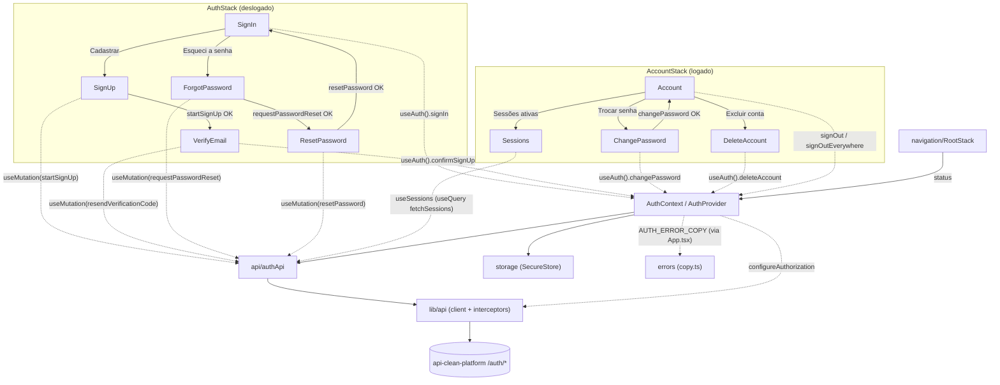

# Auth

Sessão do app: cadastro em três passos com verificação de e-mail, login,
recuperação e troca de senha, rotação do refresh token, restauração da sessão no
boot, logout (neste aparelho ou em todos), listagem das sessões ativas, exclusão
da conta e o estado que a navegação usa para escolher entre o stack logado e o
deslogado. Fala com treze dos catorze endpoints de `/auth` da API
(`api-clean-platform`): só `POST /auth/google` não tem caller, adiado até o
primeiro app se aproximar do release.

## Components

| Name        | Description                                                      |
| ----------- | ------------------------------------------------------------------ |
| `AuthProvider` | Guarda o token e o usuário. Registra-se no cliente HTTP na montagem. |
| `AuthStack` | Navigator do fluxo deslogado: `SignIn`, `SignUp`, `VerifyEmail`, `ForgotPassword` e `ResetPassword`. |
| `AccountStack` | Navigator da área logada: `Account`, `ChangePassword`, `Sessions` e `DeleteAccount`. O `AppStack` o registra como **uma** tela. |

## Hooks

| Name       | Description                                                              |
| ---------- | -------------------------------------------------------------------------- |
| `useAuth()` | `{ status, user, signIn, confirmSignUp, changePassword, deleteAccount, signOut, signOutEverywhere, isSubmitting, isSigningOut }`. Lança se usado fora do `AuthProvider`. |

## Constants

| Name            | Description                                                     |
| --------------- | ----------------------------------------------------------------- |
| `AUTH_STATUSES` | `loading` \| `signedOut` \| `signedIn`.                            |

## Types

| Name                 | Description                                           |
| -------------------- | ------------------------------------------------------- |
| `AuthStatus`         | União derivada de `AUTH_STATUSES`.                      |
| `AuthContextValue`   | O que `useAuth()` devolve.                              |
| `User`               | Perfil de `/auth/me`. Datas são strings ISO.            |
| `Credentials`        | `{ email, password }`.                                  |
| `AuthStackParamList` | Parâmetros das rotas do fluxo deslogado. `SignIn` e `VerifyEmail` aceitam um `email` opcional; `ResetPassword` exige um. |
| `AccountStackParamList` | Parâmetros das rotas da área logada (`Account`, `ChangePassword`, `Sessions`, `DeleteAccount`). |

## Flow

Cada tela do fluxo deslogado (`AuthStack`) e da área logada (`AccountStack`)
aparece como nó próprio, com a navegação real entre elas. `SignIn`,
`VerifyEmail`, `ChangePassword`, `DeleteAccount` e `Account` passam pelo
`AuthProvider` via `useAuth()`; `SignUp`, `ForgotPassword` e `ResetPassword` não
escrevem nem leem sessão, então chamam a API direto pela própria `useMutation`,
e `Sessions` só lê, pela query de `useSessions` — a mesma distinção já descrita
em prosa nas Conventions abaixo. Pra fora do módulo, o
diagrama cruza a fronteira em `lib/api` (onde o `AuthProvider` registra o
bearer token via `configureAuthorization`), `navigation/RootStack` (que lê
`status`) e `errors` (onde `App.tsx` registra `AUTH_ERROR_COPY`).

## Conventions

- **`loading` é só o boot.** Cobre ler o keychain e o primeiro `/auth/me`, e
  nunca volta. O pending de login e cadastro vive em `isSubmitting`, no botão —
  se `loading` voltasse, entrar na conta trocaria a tela por um splash no meio
  do submit.
- **`signedIn` exige token E usuário.** Token sozinho não é sessão: só
  `/auth/me` diz se ele ainda verifica.
- **O access token nunca vai para o disco.** O SecureStore guarda só o refresh
  token; o access vive em memória enquanto o processo existir. O boot restaura a
  sessão **gastando** o refresh token, não confiando num access guardado — é o
  que a decisão 11 da API prescreve, e tira do disco uma credencial válida por
  uma hora inteira.
- **Refresh é single-flight, e a API exige isso por escrito.** Dois refresh
  concorrentes com o mesmo token devolvem dois tokens e só o último emitido
  continua válido; quem guardar o outro é deslogado no refresh seguinte.
  `createSingleFlight` (em `utils/`) é o que garante uma chamada por vez, com
  quem chegar depois esperando o mesmo resultado.
- **O token rotacionado é gravado antes de o refresh resolver.** Se o processo
  morrer nesse intervalo, o disco fica com um token já gasto — que é exatamente
  o que a janela de graça de 30 segundos da API perdoa. Passado esse tempo vira
  detecção de reuso e logout, e esse é o comportamento correto, não um defeito
  a esconder.
- **`signOut` engole a falha; `signOutEverywhere` não.** O primeiro tenta o
  `POST /auth/logout` e **sempre** sai localmente: prender o usuário numa conta
  porque o aparelho está offline é pior do que um refresh token que vive até
  expirar, ainda mais quando a limpeza local apaga a única cópia dele. O segundo
  relança e **mantém** a sessão: a promessa dele é "todos os aparelhos", e
  degradar em silêncio para um logout local diria que as outras sessões
  acabaram quando não acabaram.
- **O usuário sai do token, não do cache.** O logout esvazia o cache do
  TanStack Query fora do ciclo de render do React, e cache esvaziado não agenda
  render nenhum: ler `meQuery.data` direto manteria na tela o perfil de quem
  acabou de sair. O token é estado, então perdê-lo re-renderiza.
- **O cadastro tem três passos, e a conta nasce no terceiro.** `register` só
  guarda um cadastro pendente e manda um código de seis dígitos;
  `email/verify` cria a conta **com a senha daquele request** e abre a sessão. A
  senha entra no passo 3 porque o código só chega na caixa do dono do endereço:
  quem confirma é quem escolhe a senha, e é isso que fecha o *account
  pre-hijacking*. Coletá-la no `SignUp` também deixaria uma senha em texto puro
  no estado de navegação até o passo 3.
- **`register` e `password/forgot` respondem `202` sempre, e as telas não
  ramificam.** Endereço livre, cadastro em andamento e conta existente são
  indistinguíveis pela resposta — o que muda é o e-mail que o endereço recebe.
  Qualquer condicional na tela reconstrói a enumeração de contas que a API
  removeu de propósito. Isso é propriedade de segurança, não escolha de UX.
- **Verificação e reset têm uma mensagem só cada.** A API responde um código só
  (`EMAIL_VERIFICATION_FAILED`, `PASSWORD_RESET_FAILED`) para desconhecido,
  errado, expirado e esgotado/já usado. Texto que adivinhasse entre eles
  devolveria o oráculo que ela recusou.
- **O que passa pelo `AuthContext` é o que mexe na sessão.** `signIn`,
  `confirmSignUp`, `changePassword`, `deleteAccount`, `signOut` e
  `signOutEverywhere`.
  `startSignUp`, `resendVerificationCode`, `requestPasswordReset` e
  `resetPassword` não escrevem nem leem token e não mudam `status`: são
  `useMutation` na própria tela, com o `isPending` dela. Pô-las no contexto
  faria `isSubmitting` significar quatro coisas sem relação ao mesmo tempo.
- **`changePassword` grava o token novo e mantém a sessão.** A API revoga as
  outras sessões e devolve um par novo para este aparelho; por isso ele usa
  `adoptTokens` e não `openSession` — o perfil já está em cache e não mudou, e o
  que precisa acontecer é a gravação. Não gravar deslogaria este aparelho no
  refresh seguinte.
- **O contador de reenvio reinicia numa chamada que resolveu, sem perguntar o
  que a API fez.** Reenvio dentro do cooldown do servidor responde `202` e não
  manda nada, indistinguível de um que funcionou. Uma *rejeição* é outra coisa
  — a requisição falhou, o que a API não está escondendo — então aí o botão
  continua disponível.
- **`EMAIL_NOT_VERIFIED` não leva a lugar nenhum.** Uma conta que existe e não
  está verificada não tem cadastro pendente (a linha é consumida quando a conta
  é criada), então `resend` não acharia nada e `confirm` não teria como passar.
  Mandar o usuário para a `VerifyEmail` seria um beco sem saída: só copy.
- **A área de conta é um navigator próprio.** `Account`, `ChangePassword`,
  `Sessions` e `DeleteAccount` são deste módulo — mexem em credencial e sessão — então o módulo exporta o
  `AccountStack` e o `AppStack` registra uma tela só. O interno do módulo para
  no navigator dele, que é a regra que o `RootStack` já escreve.
- **A `Account` não mostra data nenhuma; a `Sessions` mostra uma.** `/auth/me`
  também devolve `createdAt` e `emailVerifiedAt`, e renderizar qualquer um
  exigiria um formatador cujo único consumidor seria ele mesmo. A lista de
  sessões tem um consumidor de verdade: `startedAt` é o que responde "fui eu?",
  então `formatSessionDate` usa o `toLocaleString()` do aparelho, sem biblioteca
  nem decisão de locale.
- **A `Sessions` é só de leitura, e não pode ser mais que isso.** A API não
  tem endpoint para encerrar uma sessão e não diz qual delas é a de quem chama,
  então a tela não marca "este aparelho" nem oferece "encerrar esta": a única
  ação possível é o "Sign out everywhere" da `Account`. `ip` e `deviceLabel`
  vêm `null` em sessão anterior ao registro deles e ganham um texto de
  fallback; `startedAt` nunca é `null`.
- **A lista de sessões é sempre relida e é descartada com a sessão.**
  `staleTime: 0` porque outro aparelho pode abrir ou encerrar uma a qualquer
  momento. Um `changePassword` a invalida (a API revogou as outras), e o
  `endSession` a remove do cache: sem isso, a próxima conta a entrar no mesmo
  aparelho veria a lista da anterior até o refetch chegar.
- **`deleteAccount` não chama `/auth/logout`.** A exclusão é hard delete e
  leva os refresh tokens da conta junto, então não sobra o que revogar; o
  contexto só encerra a sessão local e esvazia o cache. Como `signOutEverywhere`,
  ele rejeita e **mantém** a sessão se falhar — a tela mostra o motivo. Um
  `USER_NOT_FOUND` conta como sucesso: a conta já sumiu (segundo toque, ou outro
  aparelho excluiu antes com o access token ainda válido) e o estado pedido já
  vale.
- **A confirmação da exclusão é a senha, sem `Alert`.** A ação é irreversível
  e a API não dá prazo de arrependimento nem exporta nada, então a tela avisa
  isso e pede a senha atual (só presença, como o `changePassword`; quem julga é
  a API). O body do `DELETE /auth/me` é obrigatório. Como este app não tem login
  com Google, toda conta tem senha e o formulário sempre a pede: quando o Google
  entrar, uma conta só-Google não terá o que digitar, e o `/auth/me` vai
  precisar dizer se a conta tem senha.
- **Um token que a API rejeitou é apagado; um token que falhou por rede não.**
  Estar offline no boot não é motivo para exigir a senha de novo no próximo.
- **A `message` da API nunca vai para a tela.** A copy sai de `@/errors`,
  escolhida pelo `code`; este módulo registra os seus códigos de domínio em
  `AUTH_ERROR_COPY`, e o `App.tsx` os registra na camada de erros.
  `EMAIL_ALREADY_IN_USE` **não** está lá: o `confirm-email` da API o converte em
  `EMAIL_VERIFICATION_FAILED` e o `register` responde `202` para qualquer
  endereço, então nenhum endpoint consegue enviá-lo. Uma tela
  renderizada isolada num teste não tem composition root, então registra o mesmo
  mapa no `beforeEach` — sem isso ela cai no texto genérico em silêncio.
- **O `/auth/me` do boot não é silencioso.** Se ele falhar por rede, o usuário vê
  um toast de "sem conexão" em vez de cair no login sem explicação.
- **Os schemas ficam em duas pastas por propósito diferente.**
  `validations/` valida o que o usuário digita (consumido pelo react-hook-form);
  `api/schemas.ts` valida o que a API devolve. Só o segundo é contrato de rede.
  Dentro de `validations/`, o `policy.ts` guarda tudo que espelha a API —
  constantes, copy e os schemas de campo — e os outros três arquivos agrupam os
  formulários que andam juntos.
- **"Confirmar senha" nunca sai do cliente.** Os três formulários que escolhem
  senha o validam com um `.refine`; o body da API não tem esse campo, e dois
  deles são `.strict()`.
- **Nome de rota é literal**, aqui e no resto do app: `<Stack.Screen
  name="SignIn">` e `navigation.navigate('SignUp')`. Quem declara os nomes é o
  `AuthStackParamList`, e o `tsc` recusa qualquer nome fora dele.
- `storage.web.ts` usa `localStorage`, que **não** é equivalente ao keychain —
  qualquer script da origem lê. O alvo web é conveniência de desenvolvimento,
  não superfície de produção.
- **O `AuthProvider` é só composição.** `useAuthSession` decide se **existe**
  sessão (boot, token, refresh single-flight, `meQuery`) e expõe `adoptTokens`,
  `openSession` e `endSession`; `useAuthActions` é o que se **faz** com uma.
  Nenhum dos dois é exportado pelo módulo — o contrato público é o `useAuth()`.
- **A lógica de "o que este boot/token/erro significa" mora em `utils/`**, não
  dentro do `AuthProvider`: `resolveStatus` (deriva `AuthStatus` de
  `hasCompletedBoot`/`token`/`user`), `isEndedSession` (os três códigos que
  significam sessão encerrada) e `createSingleFlight`. Nenhuma é exportada pelo
  módulo — são detalhe de implementação, testadas direto em vez de só
  indiretamente via `AuthContext.test.tsx`.
- **`isEndedSession` delega para o `classifyError` de `@/errors`** em vez de
  repetir o conjunto de códigos. Duas listas dos mesmos três códigos divergem no
  dia em que um quarto aparecer.
- **Campos de formulário vêm de `@/components`, não daqui.** `FormField`/
  `FORM_FIELD_TYPES` (em `src/components/forms/`) substituem o antigo
  `FormTextField` deste módulo — ele foi promovido junto com as primitivas de
  input, porque qualquer app clonado deste boilerplate precisa dos mesmos
  tipos de campo. Ver `src/components/README.md`.
- **`FormErrorMessage` e `SubmitButton` também vêm de `@/components`.**
  Nasceram aqui, mas qualquer tela de formulário de qualquer app clonado
  deste boilerplate precisa dos dois — a mesma exceção do segundo consumidor
  que já promoveu os inputs, não "um segundo módulo passou a precisar
  deles".
